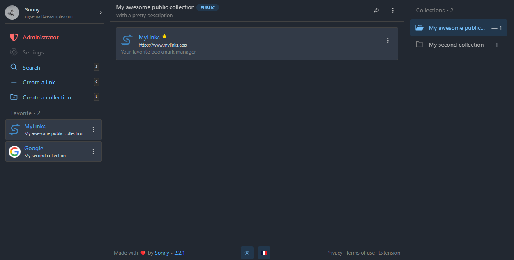

<div align="center">
  <h1>MyLinks</h1>
  <p>Another bookmark manager that lets you manage and share<br>your favorite links in an intuitive interface</p>
  <p>
    <a href="https://github.com/my-links/my-links/issues"></a>
    <a href="https://github.com/my-links/my-links/blob/main/LICENSE"></a>
    <a href="https://trello.com/b/CwxkMeZp/mylinks"></a>
  </p>
</div>

## Table of Contents
- [Main Features](#main-features)
- [Getting Started](#getting-started)
  - [Setup](#setup)
  - [Development](#development)
    - [Using Docker](#docker)
    - [Using PNPM](#pnpm)
  - [Production](#start-as-prod)
- [Configuration](#configuration)
  - [Generate app_key](#generate_app_key)
  - [GitHub Actions](#github-actions)
- [Contributing](#contributing)
- [License](#license)

## Main Features 

- **Organize bookmarks with collections**: Keep your links tidy and easily accessible by grouping them into customizable collections.
- **Intuitive link management**: Add, edit, and manage your bookmarks effortlessly with a user-friendly interface.
- **Powerful search functionality**: Quickly locate any bookmark using the robust search feature, enhancing your productivity.
- **Privacy-focused and open-source**: Enjoy a secure, transparent experience with an open-source platform that prioritizes your privacy.
- **Browser extension (coming soon)**: Seamlessly integrate MyLinks into your browsing experience with the upcoming official browser extension.
- **Shareable collections**: Easily share your curated collections with others, facilitating collaboration and information sharing.
- **Community-driven development**: Contribute to MyLinks by suggesting improvements and features, helping to shape the tool to better meet user needs.

## Getting Started

### Setup

Copy the `example.env` file to `.env` and edit the properties:

```bash
cp example.env .env
```

### Development

#### Docker

```shell
make dev
```

#### PNPM

```shell
# reset database and (force) apply all migrations
node ace migration:fresh
# start dev server
pnpm run dev
```

### Start as prod

#### Docker

```shell
make prod
```

#### PNPM

```shell
# create production build
pnpm run build
# go to the build folder
cd build
# clone your .env
cp ../.env .
# then start the production build
pnpm run start
```

## Configuration

### Generate app_key

```shell
# generate a random app key
openssl rand -base64 32
```

### GitHub Actions

Env var to define :

```shell
DOCKER_USERNAME="Your docker username"
DOCKER_PASSWORD="Your docker password"
SSH_HOST="Your SSH host"
SSH_PORT="Your SSH port" # use port 22 if you are using the default value
SSH_USERNAME="Your SSH username" # private key
SSH_KEY="Your SSH key" # see below
```

> As a good practice, SSH Key should be generated on local machine instead of target/server/remote machine

Generate :

```shell
ssh-keygen -t rsa -b 4096
# you can save the file in your current folder since you're not supposed to use it personnaly (its purpose is only to be used by CI/CD)
```

Copy :

```shell
cat ./id_rsa.pub | ssh b@B 'cat >> ~/.ssh/authorized_keys'
# or
ssh-copy-id -i ./id_rsa.pub user@host
```

> Source: https://github.com/appleboy/ssh-action#setting-up-a-ssh-key

## Contributing
We welcome contributions! Please visit our Trello board for project management and roadmap details. You can contribute by:

- Creating issues for bugs, features, or discussions.
- Submitting pull requests (PRs) with bug fixes, new features, or documentation updates.

For detailed contribution guidelines, refer to the CONTRIBUTING.md file.

## License

This project is licensed under the [GPLv3 License](./LICENCE). 
