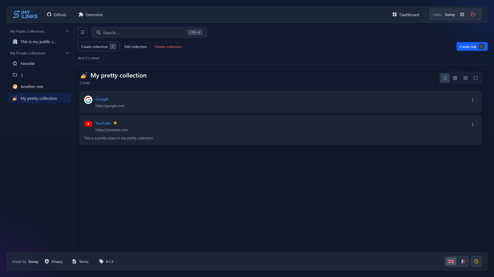

> More screenshots are available in the [`docs/public/screenshots`](./docs/public/screenshots) directory.

<div align="center">
  <h1>MyLinks</h1>
  <p>A self-hostable bookmark manager: organize, search and share your favorite links.</p>
  <p>
    <a href="https://github.com/my-links/my-links/releases/latest"></a>
    <a href="https://github.com/my-links/my-links/issues"></a>
    <a href="https://github.com/my-links/my-links/blob/main/LICENSE"></a>
  </p>
</div>

## Features

- **Collections** — group links by project or topic; a link can live in several at once, with an **Inbox** for the rest.
- **Search** — find any link or collection by name or URL.
- **Shareable collections** — a public collection is reachable with a single link, no account required on the other end.
- **Most-used links first** — opening a link counts a click, so your favorites rank themselves.
- **Browser extension** — save and search links from a side panel in Chromium and Firefox, with optional two-way syncing to your native bookmarks.
- **Privacy-focused, open-source, self-hostable** — run it on your own server and keep every link on hardware you control.

## Quickstart (Docker)

```bash
mkdir my-links-deployment && cd my-links-deployment
# docker-compose.yml pulling sonny93/my-links, plus a .env — see the full guide
docker compose up -d
```

This pulls the image from [Docker Hub](https://hub.docker.com/r/sonny93/my-links), starts PostgreSQL, applies migrations, and starts the app — reachable on the port set in `PORT` (default `3333`).

See [Docker & compose](https://docs.mylinks.app/self-hosting/docker) for the `docker-compose.yml` to copy, the environment variables it needs, and a native (non-Docker) deployment path.

## Documentation

Full documentation, including self-hosting, configuration, the API reference and the browser extension, lives at **[docs.mylinks.app](https://docs.mylinks.app)**.

Contributing to MyLinks itself? See [Contributing](https://docs.mylinks.app/contributing).

## License

This project is licensed under the [GPLv3 License](./LICENSE).
